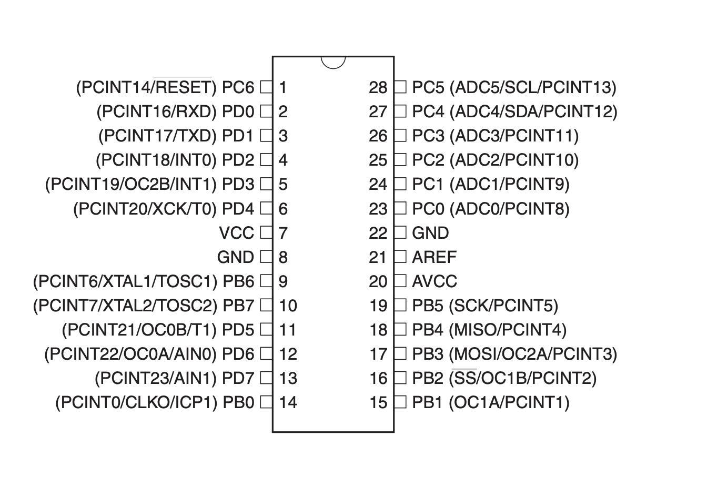

# ATmega48A - Binäruhr
Dieses Projekt entstand in meinem 5. Semester an der Hochschule für Technik, Wirtschaft und Kultur Leipzig (HTWK) als Prüfungsleistung für das Modul _Systemnahe Programmierung_. Die Aufgabe war mit einer selbst-designten Leiterplatine und vorgegebenen Bauteilen eine Uhr zu bauen und programmieren, welche die Uhrzeit in Binär anzeigt. Den Kern der Platine bildet ein ATmega48A Mikrocontroller.

Programmiert wird der ATMega48A über einen AVR-ISPMKII Adapter und der Software AVRDude.
## Pin-Belegung

### Stunden-LEDs (Links)
Stunde 20: `PD3`  
Stunde 21: `PD4`  
Stunde 22: `PD5`  
Stunde 23: `PD6`  
Stunde 24: `PD7`
Helligkeit: `PB01(OC1A)`
### Minuten-LEDs (Rechts)
Minute 20: `PC5`  
Minute 21: `PC4`  
Minute 22: `PC3`     
Minute 23: `PC2`  
Minute 24: `PC1`  
Minute 25: `PC0` 
Helligkeit:           `PB02(OC1B)`

### Taster  
Taster 1: `PB0`  
Taster 2: `PB1`  
Taster 3: `PD2`

### Sonstiges
Uhrenquarz: `PB6` + `PB7`
ISP-Adapter: `PB03` + `PB04` + `PB05`

### Erste Schritte
Am Anfang entstand nur ein einfaches Programm, welches alle LED's zum Leuchten bringen sollte, um die Funktionalität dieser zu zeigen/Testen.
